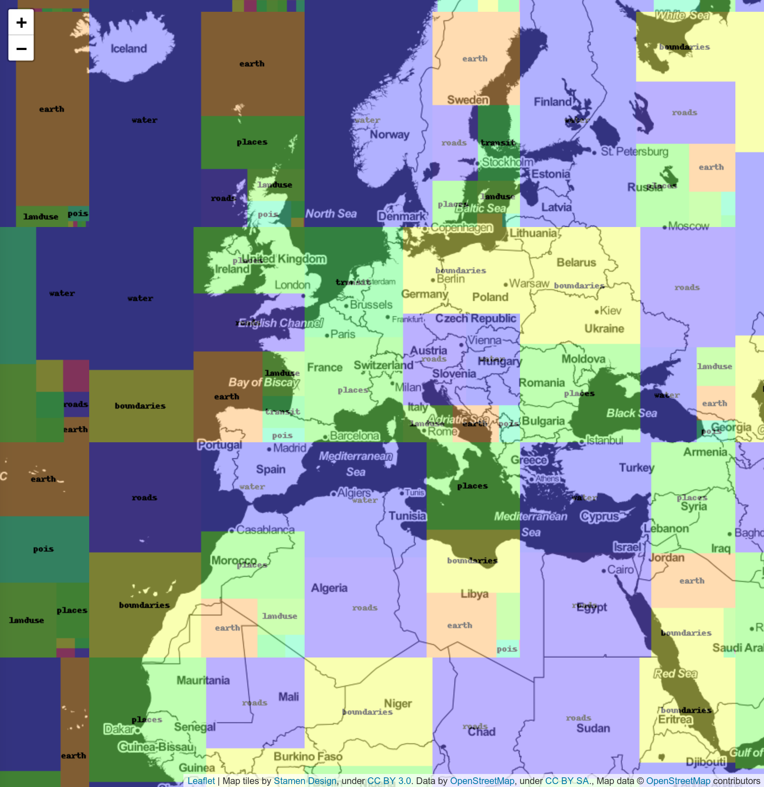

Scoville - A tool to attribute size information in MVT tiles.

Current scoville commands:

* `info`: Prints size and item count information about an MVT tile.
* `proxy`: Serves a treemap visualisation of tiles on a local HTTP server.
* `percentiles`: Calculate the percentile tile sizes for a set of MVT tiles.
* `heatmap`: Serves a heatmap visualisation of tile sizes on a local HTTP server.
* `outliers`: Calculates the tiles with the largest per-layer sizes.

### Info command ###

Running `scoville info --kind kind foo.mvt` on a [Nextzen](https://nextzen.org) tile might output something like:

```
...
.water.features.bay.count => 2
.water.features.bay.geom_cmds => 14
.water.features.bay.metadata => 8
.water.features.bay.names.count => 2 
.water.features.bay.properties => 50
.water.features.riverbank.count => 169
.water.features.riverbank.geom_cmds => 61962
.water.features.riverbank.metadata => 774
.water.features.riverbank.names.count => 176
.water.features.riverbank.properties => 3419
.water.features.water.count => 261
.water.features.water.geom_cmds => 54333
.water.features.water.metadata => 1155
.water.features.water.names.count => 363
.water.features.water.properties => 5770
.water.metadata => 16
.water.properties.keys.count => 40
.water.properties.size => 9184
.water.properties.values.count => 823
```

This is showing that in the `water` layer, there were 2 `kind: bay` features, totalling 14 bytes for the commands to draw their geometry, 50 bytes to represent their property indexes, and 8 bytes to represent their metadata. The count, across all features, of properties that look like a name is given by the `.names.count`.

Similar breakdowns are given for the other two observed `kind`s; `riverbank` and `water`.

`.water.metadata` gives the size of the metadata overhead for the `water` layer itself.

The size for property indexes is given in the kind breakdown, rather than the sum of the strings making up their key-value properties, because MVT de-duplicates property keys and values and stores them at the top level in the layer. This is given by the `.water.properties.size` entry, and counts given for the keys and values.

#### D3 output ####

The option `--d3-json` will instead output a JSON file suitable for use with [D3's treemap](https://bl.ocks.org/mbostock/4063582) visualisation. See the example code in the `examples/` directory. To get started:

```
scoville info --d3-json <YOUR FILE>.mvt > examples/treemap.json
cd examples
python -m SimpleHTTPServer
```

And visit [localhost:8000](http://localhost:8000) in a browser.

### Compare command ###

Use to compare MVT contents from two different sources for a given list of tiles.  Output is a sequence of calls to the Info command above.

Run it like this, basically `compare tile_file url_template_1 url_template_2`

```
scoville compare /path/to/tile/file.txt "https://tile.nextzen.org/tilezen/vector/v1/512/all/{z}/{x}/{y}.mvt?api_key=YOUR_API_KEY" "https://tile.nextzen.org/tilezen/vector/v1/512/something_different/{z}/{x}/{y}.mvt?api_key=YOUR_API_KEY"
```

### Proxy command ###

The proxy command will run a local tile server which, given an upstream MVT tile server, returns a treemap visualisation of each MVT tile. This can be useful to get a broad understanding of which layers take up most space, and to spot any zoom levels or tiles with unexpected distributions of space.

Run it like this, replacing the URL and/or API key as appropriate:

```
scoville proxy "https://tile.nextzen.org/tilezen/vector/v1/512/all/{z}/{x}/{y}.mvt?api_key=YOUR_API_KEY"
```

This will run a server on [localhost:8000](http://localhost:8000) by default (use `--port` option to change the port). Navigating to that page should show you something like:



### Percentiles command ###

Downloads a set of tiles and calculates percentile tile sizes, both total for the tile and per-layer within the tile. This can be useful for measuring the changes in tile size across different versions of tiles, and indicating which layers are contributing the most to outlier sizes.

For example:

```
echo "0/0/0" > tiles.txt
scoville percentiles --cache tiles.txt https://tile.nextzen.org/tilezen/vector/v1/512/all/{z}/{x}/{y}.mvt?api_key=YOUR_API_KEY
```

Will output something like:

```
               TOTAL      p50      p90      p99    p99.9
          boundaries    68731    68731    68731    68731
           buildings       19       19       19       19
               earth   110378   110378   110378   110378
             landuse       17       17       17       17
              places   471086   471086   471086   471086
                pois       14       14       14       14
               roads       15       15       15       15
             transit       17       17       17       17
               water   404996   404996   404996   404996
              ~total  1055273  1055273  1055273  1055273
```

Note that the `~total` entry is **not** the total of the column above it; it's the percentile of total tile size. In other words, if we had three tiles with three layers, and each tile had a single, different layer taking up 1000 bytes and two layers taking up 10 bytes, then each tile is 1020 bytes and that would be the p50 `~total`. However, the p50 on each individual layer would only be 10 bytes.


### Heatmap command ###

Runs a local tile server showing heatmap tiles. The darker the colour, the larger the tile is. Each 256x256 tile is made up of an 8x8 heat grid, so the smaller squares you'll see represent tiles at a zoom 3 levels down from the level you're viewing at. This stops at z16, so you'll see the squares getting coarser as you approach that zoom.

The mapping between tile size and colour is:

 * <50kB: `#ffffff`
 * <100kB: `#fff7ec`
 * <150kB: `#fee8c8`
 * <200kB: `#fdd49e`
 * <250kB: `#fdbb84`
 * <300kB: `#fc8d59`
 * <500kB: `#ef6548`
 * <750kB: `#d7301f`
 * <1000kB: `#990000`
 * >=1000kB: `#000000`

To run it:

```
scoville heatmap "https://tile.nextzen.org/tilezen/vector/v1/512/all/{z}/{x}/{y}.mvt?api_key=YOUR_API_KEY"
```

This will run a server on [localhost:8000](http://localhost:8000) by default (use `--port` option to change the port). Navigating to that page should show you something like:


### Outliers command ###

This calculates the largest tiles on a per-layer basis. For example, when run on a list of 1,000 frequently accessed tiles:

```
scoville outliers -j 4 --cache top-1000-tiles.txt 'https://tile.nextzen.org/tilezen/vector/v1/512/all/{z}/{x}/{y}.mvt?api_key=YOUR_API_KEY'
```

It gives something like the following:

```
Layer 'boundaries'
    67474 https://tile.nextzen.org/tilezen/vector/v1/512/all/5/17/11.mvt?api_key=YOUR_API_KEY
    68731 https://tile.nextzen.org/tilezen/vector/v1/512/all/0/0/0.mvt?api_key=YOUR_API_KEY
    92467 https://tile.nextzen.org/tilezen/vector/v1/512/all/4/8/5.mvt?api_key=YOUR_API_KEY
Layer 'buildings'
   359667 https://tile.nextzen.org/tilezen/vector/v1/512/all/13/3035/4647.mvt?api_key=YOUR_API_KEY
   372929 https://tile.nextzen.org/tilezen/vector/v1/512/all/13/3034/4647.mvt?api_key=YOUR_API_KEY
   408946 https://tile.nextzen.org/tilezen/vector/v1/512/all/13/3033/4647.mvt?api_key=YOUR_API_KEY
Layer 'earth'
    94603 https://tile.nextzen.org/tilezen/vector/v1/512/all/7/62/44.mvt?api_key=YOUR_API_KEY
    98898 https://tile.nextzen.org/tilezen/vector/v1/512/all/7/68/40.mvt?api_key=YOUR_API_KEY
   110378 https://tile.nextzen.org/tilezen/vector/v1/512/all/0/0/0.mvt?api_key=YOUR_API_KEY
Layer 'landuse'
   191312 https://tile.nextzen.org/tilezen/vector/v1/512/all/9/263/170.mvt?api_key=YOUR_API_KEY
   196733 https://tile.nextzen.org/tilezen/vector/v1/512/all/9/262/170.mvt?api_key=YOUR_API_KEY
   271852 https://tile.nextzen.org/tilezen/vector/v1/512/all/9/263/169.mvt?api_key=YOUR_API_KEY
...
```

For each layer, it calculates the tiles which use the most bytes for that layer. The top tile URLs are listed, grouped by layer, with each line showing the size of the layer and the URL. Further investigation can be done by pasting the tile URL into the `info` command.

By default, it outputs the top 3 tiles, but this can be changed with the `-n` command line option. Runs can be parallelised by using the `-j` option, and cached using the `--cache` option (useful if this is not a one-off, and you might run several commands against the same tile set).

## Install on Ubuntu:

```
pip install -r requirements.txt
```
